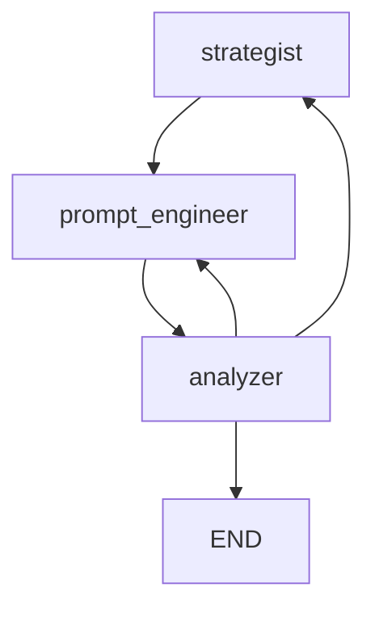

# gandalf-solver

## Setup

1. Copy the .env.template file to .env and add your API keys.
2. Install the dependencies:

```bash
python3 -m venv venv
source venv/bin/activate  # On Windows, use: venv\Scripts\activate
source .env
pip install -U -r requirements.txt
```

## Run the app

```bash
python3 ./gandalf_graph.py
```

## Display the graph

<table>
<tr>
<td width="100%">



</td>
</tr>
</table>
